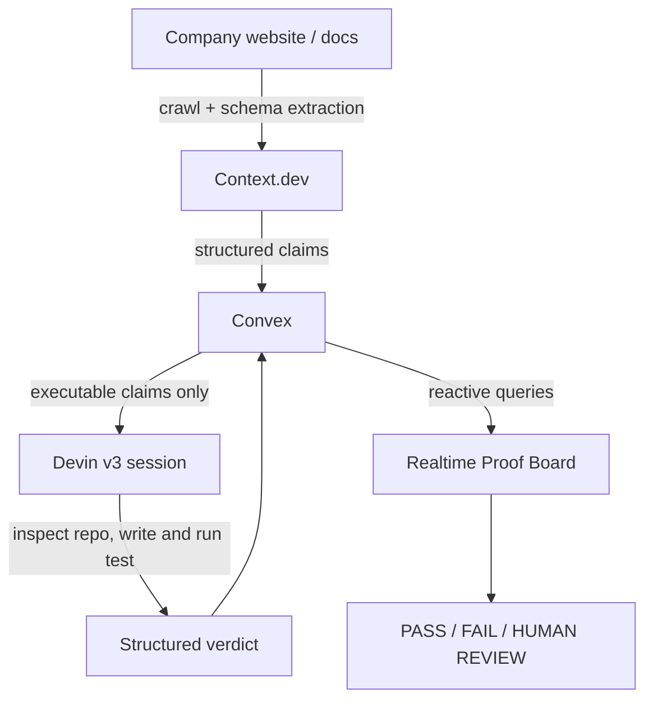

# KanForge

**Claims in. Evidence out.**

KanForge turns technical product claims into executable evidence. It reads the claims a company makes in its own documentation, decides which ones can actually be proven, and then has an autonomous agent inspect the repository and run a test to settle them.

It does not ask a language model whether a claim *sounds* believable. It tries to **prove** it.

---

## Problem

Every software company publishes technical claims: retry counts, signing algorithms, endpoint behaviour, rate limits, uptime, compliance. Documentation drifts from implementation constantly — a retry budget gets lowered in a hotfix, the docs never change, and nobody notices until an integration breaks in production.

Verifying that documentation still matches implementation is slow, manual, and nobody's job. Existing "AI doc checkers" ask a model whether text looks plausible, which detects nothing, because a false claim reads exactly like a true one.

## Solution

KanForge treats a claim as a **testable hypothesis** rather than a string to be judged.

```
MARKETING / DOCUMENTATION CLAIM
        ↓
SOURCE-GROUNDED TECHNICAL CLAIM      (Context.dev)
        ↓
EXECUTABLE VERIFICATION PLAN         (KanForge classifier)
        ↓
DEVIN ACTUALLY TESTS IT              (Devin v3)
        ↓
REPRODUCIBLE EVIDENCE                (Convex, realtime)
```

The critical design decision is that KanForge **refuses to fake verification**. A claim like "we are SOC 2 Type II compliant" is not something a repository test can settle, so KanForge classifies it `human_review`, explains why, and states what evidence *would* settle it. Honest abstention is a feature — it is what makes the PASS and FAIL verdicts trustworthy.

## Architecture



Convex is the spine: the client captures intent in a mutation, durable state is written transactionally, the scheduler hands external work to actions, and the UI re-renders from reactive queries. No polling from the browser, no websocket plumbing.

### Why each technology is essential

**Context.dev** — the entry point. KanForge needs claims that are *source-grounded*: tied to a real URL and a verbatim excerpt, not paraphrased by a model. Context.dev `/web/extract` crawls the target and returns data already shaped to a JSON Schema we supply, so a claim arrives with its category, its expected behaviour, and a suggested verification strategy in one call. Without it there is no grounded input, and "which sentence did this come from?" has no answer.

**Convex** — the orchestration and realtime layer. Verification is long-running and multi-stage: create a job, call an external agent, poll it, nudge it, persist evidence. Convex's scheduler and action/mutation split model this exactly, and its reactive queries make the proof board update with no client polling. It also holds every API key server-side, so no secret ever reaches the browser.

**Devin** — the actual prover, and the reason KanForge is not a text classifier. Devin clones the repository, reads the implementation, writes a temporary test, runs it, and reports what it observed. This is the step that turns an opinion into evidence.

## How it works

1. **Extract** — a Convex action calls Context.dev `/web/extract` with a JSON Schema for technical claims. Returns claims with source URL, verbatim excerpt, category, expected behaviour, and a suggested verification strategy.
2. **Classify** — each claim is typed `executable`, `evidence_only`, or `human_review`. Only `executable` claims are eligible for a Devin run; the rest are terminal on arrival with a stated reason.
3. **Verify** — clicking VERIFY creates a `verificationJob` (idempotent against double-clicks) and schedules a Devin v3 session with a `structured_output_schema`, a strict verify-don't-implement prompt, and a `max_acu_limit` spend cap.
4. **Settle** — Convex polls the session, persists evidence, and the board updates live.

### The poll/nudge state machine

Devin's `structured_output_required: true` does **not** reliably force structured output — we verified this empirically before writing the integration. Sessions can answer in a chat message and park at `waiting_for_user` with `structured_output: null`.

KanForge handles this explicitly:

```
create session -> poll
  |- structured_output present     -> persist evidence, settle verdict
  |- stalled AND not yet nudged    -> send ONE follow-up demanding
  |                                   provide_structured_output(is_final=true), then poll again
  |- stalled AND already nudged    -> HUMAN_REVIEW (no infinite nudging)
  |- pollCount > 40 (~10 minutes)  -> HUMAN_REVIEW (no infinite polling)
```

Every job tracks `nudgeSent`, `pollCount`, `startedAt`, and `lastPolledAt`, so the loop is bounded on both axes.

## Demo flow

1. **Load demo target** — fills the synthetic ForgeRelay target and this repository.
2. **Analyze claims** — a real Context.dev call; claims stream into the board via Convex.
3. **Verify** the webhook-retry claim — a real Devin session inspects this repository.
4. **FAIL** — expected `3 retries`, observed `2 retries`.
5. Contrast with a PASS claim and a HUMAN REVIEW claim.
6. **Technology Trace** shows every real provider event, in order.

## Synthetic demo target disclosure

`/demo-target` describes **ForgeRelay**, a **fictional** company created solely for this demo. It does not describe, impersonate, or reference any real company or product, and every statement on that page is invented.

Its backing code lives in `lib/forgerelay/`. One implementation deliberately contradicts its documentation: the docs claim three webhook retries, `webhook-delivery.ts` implements two. That mismatch is intentional and gives the demo a deterministic, reproducible FAIL for KanForge to discover.

## Local setup

```bash
npm install
npx convex dev
npm run dev
```

Set the server-side secrets on the Convex deployment (never in `.env.local`, never in the client):

```bash
npx convex env set CONTEXT_DEV_API_KEY
npx convex env set DEVIN_API_KEY
npx convex env set DEVIN_ORG_ID
```

Omitting the value pipes it in via stdin, keeping it out of shell history.

## Environment variables

Names only — no values appear in this repository.

| Name | Where it lives | Purpose |
| --- | --- | --- |
| `CONTEXT_DEV_API_KEY` | Convex deployment | Context.dev extraction (server-side only) |
| `DEVIN_API_KEY` | Convex deployment | Devin v3 service-user credential |
| `DEVIN_ORG_ID` | Convex deployment | Devin organization scope |
| `NEXT_PUBLIC_CONVEX_URL` | `.env.local` / Vercel | Public Convex client URL (not a secret) |

## Security

- No API key is ever exposed to the browser. Context.dev and Devin are called **only** from Convex actions.
- Nothing secret is stored in `NEXT_PUBLIC_*`, in the repository, or in this README.
- `.env*` is gitignored.
- Website and repository URLs are validated before use; repositories are restricted to public GitHub URLs.
- The Devin credential is a **service user** with the **Member** role — the least privilege that can create sessions — and its GitHub App installation is scoped to this repository alone.
- Devin sessions are instructed not to push, branch, or open pull requests, and run with a `max_acu_limit` spend cap.

## Limitations

- Public GitHub repositories only. Private-repo OAuth is out of scope for this build.
- Context.dev `/web/extract` sets `maxAgeMs` to 7 days, so repeated runs against the same URL reuse the upstream crawl and return faster (~10s vs ~23s measured). This speeds up repeat runs but **still consumes 10 credits per call** — it is upstream crawl caching, not free replay, and never fixture substitution.
- Devin verdicts are only as good as Devin's inspection. KanForge records the `limitations` the agent reports rather than hiding them.
- A claim can be *correctly* classified `human_review` and still be true. KanForge reports what it can prove, not what is true.
- The board verifies one claim at a time by design, to bound agent spend.

## Hackathon disclosure

Built during the **Collabute X TheBlock. Hackathon**, Dubai — a one-day AI hackathon on 30 August 2026 (10:30-17:00 GST), in accordance with event rules.

All product code in this repository was written during the event. Before the event started, work was limited to account setup, credential provisioning, and reading current API documentation; the repository contained no product code at the start gun (its only commit was an empty initialisation commit).

The event requires all three partner technologies to be used meaningfully. In KanForge each is load-bearing: remove Context.dev and there is no grounded claim to test, remove Convex and there is no orchestration or realtime state, remove Devin and there is no proof — only opinion.
