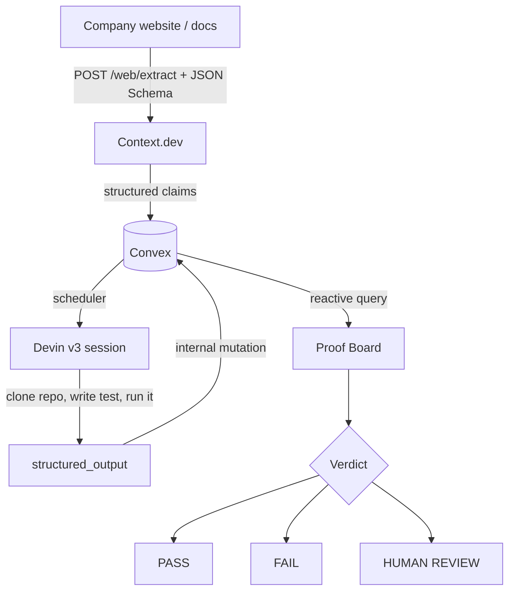

# KanForge — Architecture

## Overview

KanForge is a verification pipeline, not a chat product. It has one job: take a claim written in prose and produce evidence about whether the code behind it actually behaves that way.



## Data model

Five tables, all in `convex/schema.ts`.

| Table | Purpose | Key indexes |
| --- | --- | --- |
| `analyses` | One run against one website + repository | `by_createdAt` |
| `claims` | Extracted, classified claims | `by_analysisId_and_order` |
| `verificationJobs` | One Devin session attempt per claim | `by_claimId`, `by_devinSessionId` |
| `evidence` | Structured proof returned by Devin | `by_claimId` |
| `events` | Provider-tagged trace of everything that happened | `by_analysisId_and_timestamp` |

`events` exists specifically so the Technology Trace is derived from real recorded activity rather than reconstructed in the UI. Every provider call writes one.

## Control flow

KanForge follows the Convex pattern strictly:

1. **Client captures intent** — `analyses.create` / `devin.verifyClaim` are mutations. They validate, write durable state, and schedule work. They never call the network.
2. **Scheduler hands off** — `ctx.scheduler.runAfter(0, ...)` moves execution to an action.
3. **Actions do external I/O** — `contextPipeline.runExtraction` and `devin.startSession` / `devin.pollSession` are the only places that touch the network.
4. **Actions write back through internal mutations** — never directly, since actions have no `ctx.db`.
5. **UI reads reactive queries** — `useQuery` re-renders on change. No client polling anywhere.

This split is why a long-running Devin session doesn't block anything: the mutation returns instantly, and the board animates forward as the scheduler drives the job.

## Context.dev integration

Registered as an official Convex component in `convex/convex.config.ts`:

```ts
const app = defineApp({ env: { CONTEXT_DEV_API_KEY: v.string() } });
app.use(contextDev, { env: { CONTEXT_DEV_API_KEY: app.env.CONTEXT_DEV_API_KEY } });
```

The key is declared as a typed environment contract and lives only on the Convex deployment.

`contextPipeline.runExtraction` calls `/web/extract` with a JSON Schema describing a claim. The endpoint crawls the site and returns objects already matching that schema, so KanForge does no free-text parsing. The instructions deliberately push the classifier to be conservative — compliance certifications and SLAs are explicitly never `executable`.

Cost controls: `maxPages: 3` bounds the crawl and `maxAgeMs: 604800000` (7 days) lets repeated runs reuse the upstream crawl, which cuts latency roughly in half. Extraction costs 10 credits per call regardless — measured against the live account, two extractions consumed 20 credits — so the cache buys speed and determinism, not free calls.

## Devin integration

`convex/devin.ts` is the runtime verification engine.

Session creation posts to `POST /v3/organizations/{org_id}/sessions` with:

- `prompt` — a verify-don't-implement instruction carrying the claim, its source excerpt, expected behaviour, and suggested strategy
- `repos: [owner/repo]` **and** the full URL inside the prompt (the `repos` field is undocumented, so we supply both)
- `structured_output_schema` — the verdict contract, validated server-side by Devin
- `max_acu_limit: 3` — hard spend cap
- `resumable: false` — disposable session

### Bounded poll/nudge state machine

We verified empirically that `structured_output_required: true` does **not** reliably force output; sessions can answer in chat and park at `waiting_for_user`. The orchestrator handles that explicitly:

```
pollSession (every 15s, max 40 polls ≈ 10 min)
  ├─ structured_output present            → finish(): persist evidence + verdict
  ├─ stalled AND !nudgeSent               → POST one message demanding
  │                                          provide_structured_output(is_final=true)
  │                                          set nudgeSent = true, keep polling
  ├─ stalled AND nudgeSent                → HUMAN_REVIEW, stop
  └─ pollCount > MAX_POLLS                → HUMAN_REVIEW, stop
```

Bounded on both axes: at most one nudge, at most forty polls. `verificationJobs` persists `nudgeSent`, `pollCount`, `startedAt`, and `lastPolledAt` so the state survives across scheduled invocations.

### Idempotency

`devin.verifyClaim` calls `jobs.activeForClaim` first and returns `{ started: false }` if a job is already in `queued | creating | running | nudged`. Double-clicking VERIFY cannot create two Devin sessions.

## Classification policy

The verifiability triage is the product's credibility boundary:

| Class | Meaning | Outcome |
| --- | --- | --- |
| `executable` | A repository test can settle it | Eligible for a Devin session |
| `evidence_only` | Checkable, but not by running this repo | Terminal `HUMAN_REVIEW` with a reason |
| `human_review` | Subjective or externally attested | Terminal `HUMAN_REVIEW` with a reason |

Non-executable claims are marked terminal the moment they are inserted (`claims.insertMany`). There is no code path that can produce a PASS for a claim a repository test cannot settle.

## Security model

- Secrets live only in Convex deployment environment variables. Nothing sensitive is in `NEXT_PUBLIC_*`, the bundle, or the repository.
- Context.dev and Devin are unreachable from the browser; both are called exclusively from Convex actions.
- The Devin principal is a service user with the **Member** role, and its GitHub App install is scoped to a single repository.
- Devin is instructed not to push, branch, or open pull requests, and is capped by `max_acu_limit`.
- Input URLs are validated; repositories must match a public GitHub URL pattern.

## Failure handling

| Failure | Behaviour |
| --- | --- |
| Invalid URL | Rejected client-side before any mutation |
| Context.dev error / timeout | Analysis set to `error`, message surfaced, event logged |
| Zero claims extracted | Explicit "no technical claims" state, not an empty board |
| Devin auth failure | Job `failed`, claim `ERROR`, event logged with status code |
| Devin never returns structured output | One nudge, then `HUMAN_REVIEW` |
| Devin exceeds time budget | `HUMAN_REVIEW` at poll 40 |
| Duplicate VERIFY clicks | Second call is a no-op |

Every failure path writes an event, so the Technology Trace shows what actually went wrong.
